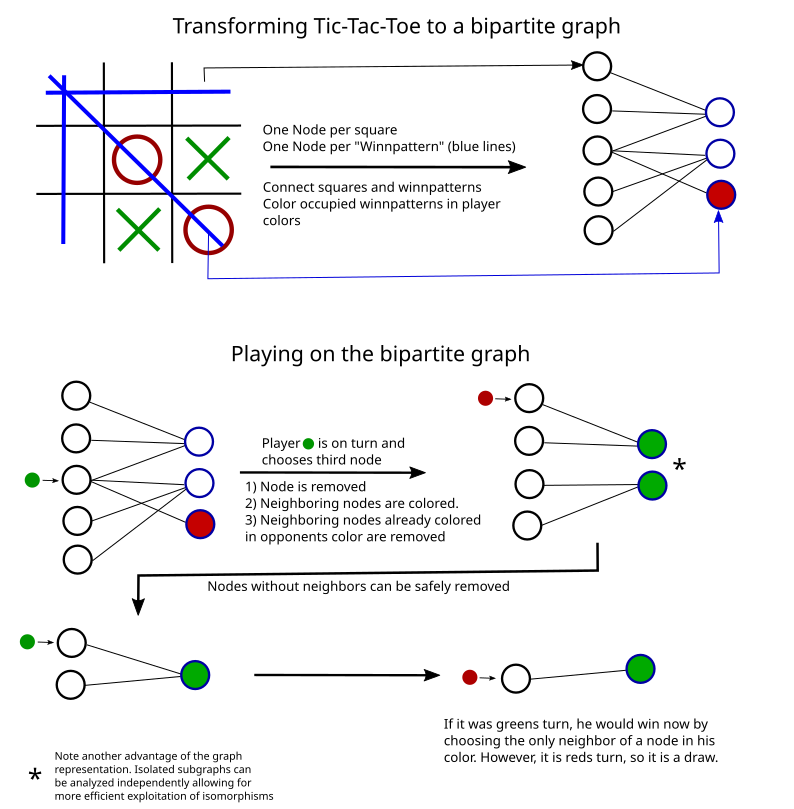

# GN0
## Literature
Graph nets: https://arxiv.org/pdf/1806.01261.pdf  
Go zero: https://www.nature.com/articles/nature24270  
Pytorch Geometric: https://arxiv.org/pdf/1903.02428.pdf  
GNs suck: https://arxiv.org/abs/2010.13993  
GCN: https://arxiv.org/pdf/1609.02907.pdf  
Hex Graphs: https://webdocs.cs.ualberta.ca/~hayward/theses/ph.pdf
Hex Variants, hex information: https://www.taylorfrancis.com/books/mono/10.1201/9780429031960/hex-inside-ryan-hayward-bjarne-toft  
Computer Hex: https://webdocs.cs.ualberta.ca/~hayward/hex/#wolve  
Some MCTS engine: https://github.com/FutaAlice/FutaHex2  
HEX Monte Carlo Value Iteration: https://github.com/harbecke/HexHex  
General Alpha-Zero player playing HEX: https://github.com/richemslie/galvanise_zero  
Latex hex package: https://ctan.org/tex-archive/macros/latex/contrib/hexgame/

## Some things to note
Hex: There is an easy, fairly accurate position evaluation function using "voltage flow".

## Benchmark
https://ogb.stanford.edu/docs/leader_nodeprop/

## Graph representation

## The story of my progress
I attemted to solve Qango using PN-Search. After failing by using the traditional algorithm due to too high computation times, I wondered how I could exploit symmetries in the game tree and the board layout to reduce the complexity of the search. Thus, I came up with the graph representation for Qango and Tic-Tac-Toe. Using DAG-PN-Search I was able to build a solver for this general class of games that can be represented via my graph structure and was able to solve Qango in all it's shapes and forms.

In a next step, I created [https://python.yannikkeller.de/solver/](https://python.yannikkeller.de/solver/) to share the solution via the web.

Now I am working on making Graph-Neural networks learn to play games represented by my graph structure. The idea is to use the Monte Carlo Tree Search approach that is used by Alpha Zero to train the Graph-Neural network. However, currently I am just trying to make the network learn by using my previously computed solutions. Situation right now, is that my network is slow because of x[graph_assignment == i] stuff. I fixed this using torch_scatter.

Now I am creating a script to evaluate a trained model.

## Tips
Use build pytorch with gpu support without attached gpu: TORCH_CUDA_ARCH_LIST=Turing

## Name of thesis
Maybe: "Improving Generalization of Self-Play Reinforcement Learning Algorithms with Graph Neural Networks"
