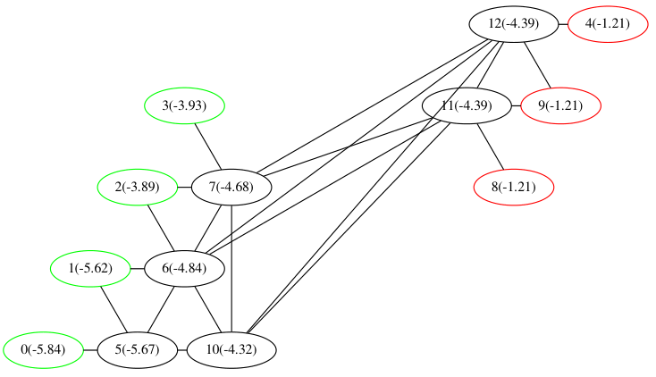
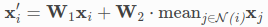

# I learned 5x5 Hex using CrazyAra and GNNs (งツ)ว
## The good part
+ Policy and value extimates of raw network perfect in almost every situation 
## The bad part
+ Still fails the most complicated opening move after 10h training (Rainbow DQN agent also had problems with it)
+ Only works with Batch Size 8 / Num Threads 1
+ 20% GPU utilization

# CrazyAra questions
+ How does threading / batching / virtual loss work in CrazyAra?
	- Doe multiple threads batch results together for nn\_evaluation?
		* It does not seem like that to me, as each SearchThread is running it's own create_mini_batch() and runs inference on it.
		* This surprises me, as I would have expected the most efficiency gains from batching the data from multiple threads together.
	- `searchThreads[i]->set_root_node(rootNode.get());` -> So many threads are working on the same MCTS tree.
		* If I increase the batch size or the number of threads, this results in huge virtual loss counts. (For batch size 128 and num threads 8, virtual loss climbs up to 150).
		* Sometimes this results in `Assertion `d->virtualLossCounter[childIdx] != 0' failed` during revert_virtual_loss. Maybe you remember, why you put that assert there and how you fixed the problem?
	- During Selfplay for RL data generation, we need to run muliple games anyway. To me, it seems like this is done sequentially, one after the other. Why not run many games simultaniously and batch nn inputs from them together? This would avoid a lot of virutal loss and allow for higher batch sizes. 
	- What number of threads / batch sizes do you use when running on a single gpu?
	- How much virtual loss can one MCTS handle without biasing the tree search too much?

+ Why is the default option in `options.cpp` and `rl\_config.py` to use only batch size 8. This seems very inefficient to me, as my (and I assume most) NNs/GPUs are able to process much larger batches in parallel. Is this just a bad default, or is it to avoid the problems with virtual loss, that I am experiencing.
+ Where can I find sensible defaults for RL training with CrazyAra. Are the values in rl\_config.py or options.cpp sensible defaults
	- Or which parameters where used in other experiments.
+ Why aren't MCTS search trees reused by default for RL in crazyara options?
+ Why such a complicated LR/Momentum schedule?

# A GNN problem
The graph network that I am using can not differentiate between nodes that are different in rare circumstances:  
  

The reason for this is the mean in the GraphSage aggregation:

If all neighbor nodes are isomorph, we can't differentiate between how many neighbors we have.
## Solution Ideas
1. Add degree as a node feature.
2. Use different GNN type that does not use mean but sum to differentiate between neighbors (which?).

## Random notes
+ I will need an explicit swap rule representation.
	- Run MCTS in starting state, but play random move fails, because value estimate of starting position will be wrong.
	- Initialize with random move and start with MCTS after first move fails, because I do not learn anything about the starting position.
	- Only idea: Add as another node feature if swap is allowed and add addtional global output if should swap which is always ignored except in first state.
